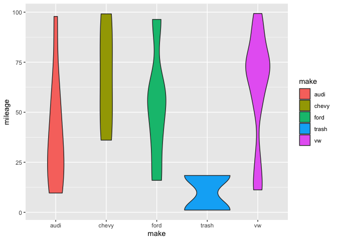

hmk_04
================
Ryan Oldridge

## Hmk_04

loading tidyverse because i have to and forgot about it and wondered why
my stuff wouldn’t work

``` r
library(tidyverse)
```

    ── Attaching packages ─────────────────────────────────────── tidyverse 1.3.2 ──
    ✔ ggplot2 3.3.6      ✔ purrr   0.3.4 
    ✔ tibble  3.1.8      ✔ dplyr   1.0.10
    ✔ tidyr   1.2.1      ✔ stringr 1.4.1 
    ✔ readr   2.1.2      ✔ forcats 0.5.2 
    ── Conflicts ────────────────────────────────────────── tidyverse_conflicts() ──
    ✖ dplyr::filter() masks stats::filter()
    ✖ dplyr::lag()    masks stats::lag()

``` r
data <- read_csv("fake_data.csv")
```

    Rows: 34 Columns: 2
    ── Column specification ────────────────────────────────────────────────────────
    Delimiter: ","
    chr (1): make
    dbl (1): mileage

    ℹ Use `spec()` to retrieve the full column specification for this data.
    ℹ Specify the column types or set `show_col_types = FALSE` to quiet this message.

making the graph because thats the homework

``` r
ggplot(data) + 
  geom_violin(aes(x=make, y=mileage, fill=make))
```


