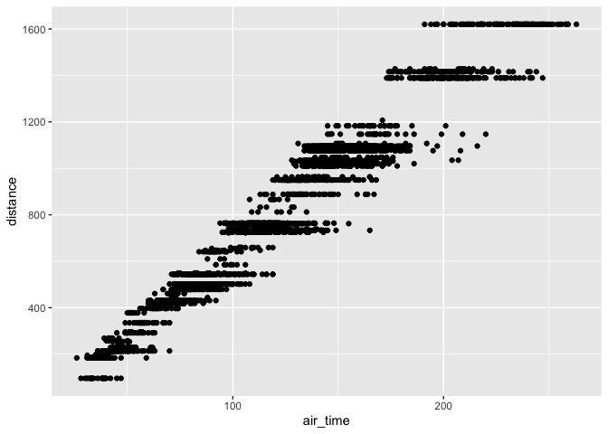
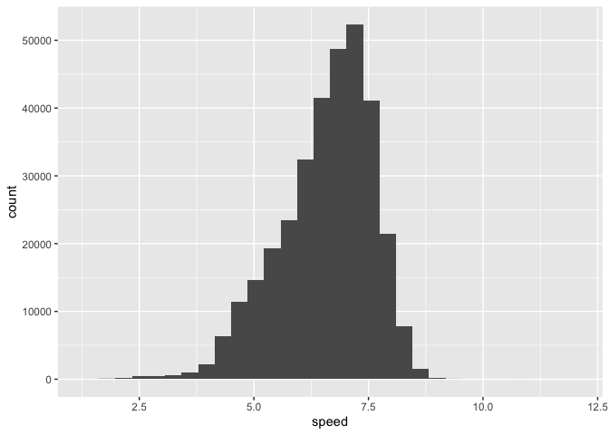

Hmk_05 template
================
Ryan Oldridge

## Installed nycflights and tidyverse

``` r
library(nycflights13)
library(tidyverse)
```

# Question 1: filtering

``` r
flights1 <- filter(flights,origin == "LGA", day == 16, distance < 2000)

ggplot(flights1) +
  geom_point(aes(x=air_time, y= distance))
```

    Warning: Removed 75 rows containing missing values (geom_point).



# Question 2: dealing with NAs

``` r
flights2 <- filter(flights, !(is.na(arr_time) | is.na(dep_time)))
```

made a filter that will remove the NA’s from the air time and departure
time.

## filtering NAs

``` r
flights1 <- filter(flights, !(is.na(air_time)), origin == "LGA", day == 16, distance < 2000)

ggplot(flights1) +
  geom_point(aes(x=air_time, y= distance))
```


plotted the new data set that removed the NA’s

# Question 3: adding columns

used the mutate function to add the column speed

``` r
flights3 <- mutate(flights, speed = distance / air_time)
ggplot(flights3) +
  geom_histogram(aes(x=speed))
```

    Warning: Removed 9430 rows containing non-finite values (stat_bin).


